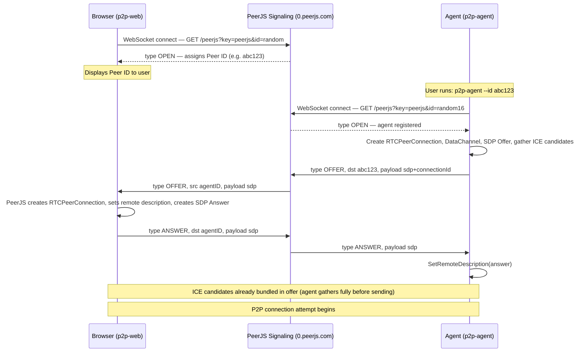
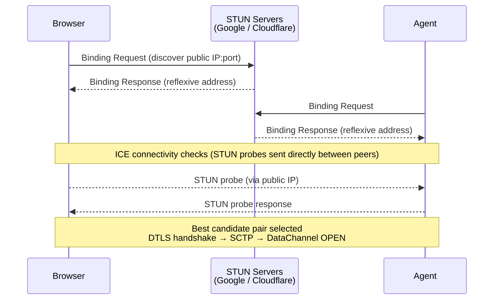
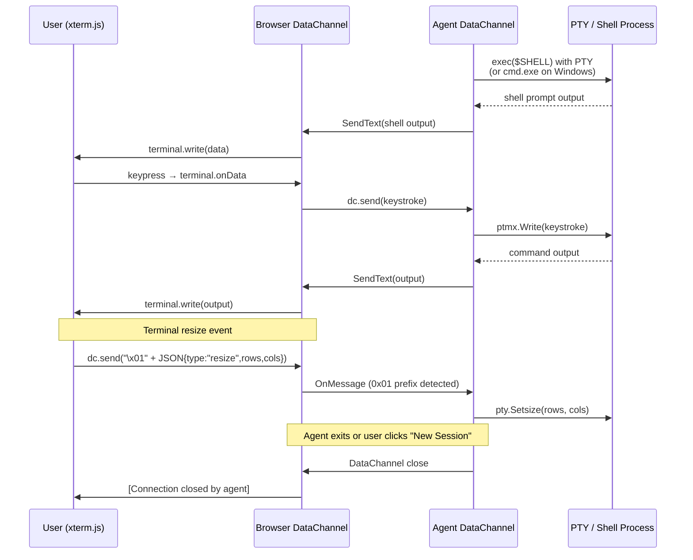

# 🐚 p2p-shell

A lightweight peer-to-peer reverse shell built on WebRTC data channels, enabling direct encrypted shell access between peers **without a central relay server** — no VPN, no open ports, no SSH.

---

## Table of Contents

- [How It Works](#how-it-works)
- [Architecture](#architecture)
- [Communication Flow](#communication-flow)
  - [1. Signaling Phase](#1-signaling-phase)
  - [2. ICE / NAT Traversal](#2-ice--nat-traversal)
  - [3. Shell Session](#3-shell-session)
- [Components](#components)
  - [p2p-web — Browser UI](#p2p-web--browser-ui)
  - [p2p-agent — Go CLI Agent](#p2p-agent--go-cli-agent)
- [Quick Start](#quick-start)
- [Self-Hosting](#self-hosting)
  - [Building the Agent Binaries](#building-the-agent-binaries)
  - [Serving the Web UI](#serving-the-web-ui)
- [Security Notes](#security-notes)

---

## How It Works

P2P Shell has two components:

| Component | Role | Technology |
|-----------|------|------------|
| **p2p-web** | Browser-based terminal UI | HTML + PeerJS + xterm.js |
| **p2p-agent** | Target machine CLI agent | Go + Pion WebRTC |

The browser acts as the **listener** — it opens a terminal and waits for an agent to connect. The agent acts as the **caller** — it dials the browser peer, establishes a direct WebRTC DataChannel, and attaches a PTY shell (or `cmd.exe` on Windows) to that channel. All traffic is **end-to-end encrypted** by DTLS (built into WebRTC).

A third-party PeerJS signaling server (`0.peerjs.com`) is used only to exchange the initial WebRTC offer/answer handshake. Once the P2P connection is established, the signaling server carries no further traffic.

---

## Architecture

```
┌────────────────────────────────────────────────────────────┐
│                    PUBLIC INTERNET                          │
│                                                            │
│   ┌──────────────┐      WebSocket (WSS)      ┌──────────┐ │
│   │   Browser    │◄─────────────────────────►│  PeerJS  │ │
│   │  (p2p-web)   │                           │ Signaling│ │
│   └──────┬───────┘      WebSocket (WSS)      │  Server  │ │
│          │         ┌───────────────────────► │          │ │
│   ┌──────┴───────┐ │                         └──────────┘ │
│   │  p2p-agent   ├─┘                                      │
│   │  (Go binary) │                                        │
│   └──────┬───────┘                                        │
│          │                                                 │
│          │   STUN servers (NAT discovery)                  │
│          │   ┌─────────────────────────────────────────┐  │
│          └──►│  stun.l.google.com / stun.cloudflare.com│  │
│              └─────────────────────────────────────────┘  │
│                                                            │
│   ┌─────────────────────────────────────────────────────┐ │
│   │          WebRTC DataChannel (DTLS-encrypted)         │ │
│   │               Browser ◄──────────► Agent            │ │
│   └─────────────────────────────────────────────────────┘ │
└────────────────────────────────────────────────────────────┘
```

---

## Communication Flow

### 1. Signaling Phase

The PeerJS signaling server acts as a rendezvous point. It is only used to exchange the WebRTC SDP offer/answer and ICE candidates — it never sees shell data.



### 2. ICE / NAT Traversal

After the offer/answer exchange, WebRTC uses STUN servers to discover public addresses and attempt a direct peer-to-peer connection through NAT.



### 3. Shell Session

Once the DataChannel is open, the agent spawns a shell and bidirectionally bridges I/O.



---

## Components

### p2p-web — Browser UI

Located in `p2p-web/`. A self-contained single-page app with no build step required.

| File | Purpose |
|------|---------|
| `index.html` | UI layout — waiting panel (Peer ID + download commands) and terminal panel |
| `script.js` | PeerJS peer setup, WebRTC DataChannel handling, xterm.js terminal wiring |
| `style.css` | Dark-theme terminal UI styles |

**External dependencies** (loaded from CDN):
- [PeerJS](https://peerjs.com/) `1.5.4` — abstracts WebRTC + PeerJS signaling protocol
- [xterm.js](https://xtermjs.org/) `5.3.0` — in-browser terminal emulator
- [xterm-addon-fit](https://github.com/xtermjs/xterm.js/tree/master/addons/addon-fit) `0.8.0` — auto-resizes terminal to container

**Key design detail:** The browser accesses `conn.dataChannel` directly (bypassing PeerJS's JSON serialization layer) to send and receive raw bytes. This lets xterm.js render ANSI escape codes correctly.

**Download command generation:** `script.js` generates platform-specific one-liners using `window.top.location.origin` as the base URL, pointing at `/b/p2p-agent/<platform>`. This means the web server that hosts `p2p-web/` must also serve the compiled agent binaries at that path (see [Self-Hosting](#self-hosting)).

### p2p-agent — Go CLI Agent

Located in `p2p-agent/`. A single Go binary with no runtime dependencies.

| File | Purpose |
|------|---------|
| `main.go` | CLI entry point, PeerJS WebSocket signaling, WebRTC offer/answer, DataChannel setup |
| `shell_unix.go` | PTY-based shell on Linux / macOS (build tag `!windows`) |
| `shell_windows.go` | Pipe-based `cmd.exe` on Windows (build tag `windows`) |
| `build.sh` | Cross-compile for all platforms (requires Go toolchain on host) |
| `build-docker.sh` | Cross-compile inside Docker (no local Go required) |
| `Dockerfile.build` | Multi-stage Docker build for reproducible cross-compilation |

**Key design decisions:**
- The agent **fully gathers ICE candidates before sending the offer** (rather than trickling). This ensures the offer arrives with all candidates embedded, simplifying firewall traversal and reducing round-trips over the signaling channel.
- **PTY on Unix:** Uses `github.com/creack/pty` to spawn a real pseudoterminal so interactive programs (vim, htop, etc.) work correctly with ANSI codes and resize events.
- **Control messages:** Terminal resize events are sent as `\x01` + JSON over the DataChannel. The `0x01` (SOH) prefix lets the agent distinguish control frames from raw stdin data without a separate channel.

---

## Quick Start

### 1. Open the web UI

Serve the `p2p-web/` directory with any static file server and open it in a browser:

```bash
# Python
python3 -m http.server 8080 --directory p2p-web

# Node.js (npx)
npx serve p2p-web
```

Or open `p2p-web/index.html` directly as a `file://` URL — PeerJS works without a server.

### 2. Run the agent on the target machine

The browser will display a **Peer ID** and a ready-to-paste one-liner per platform. On the target machine, run the generated command, for example:

```bash
# Linux x86_64
curl -sSL https://<your-host>/b/p2p-agent/linux-amd64 -o /tmp/p2p-agent \
  && chmod +x /tmp/p2p-agent \
  && /tmp/p2p-agent --id <PEER_ID>

# Or build from source and run directly:
cd p2p-agent && go run . --id <PEER_ID>
```

The agent connects back to the browser, a PTY shell opens in the terminal, and you have an interactive session.

---

## Self-Hosting

To host p2p-shell yourself (so the download one-liners point to your server):

### Building the Agent Binaries

```bash
cd p2p-agent

# Option A: local Go toolchain (Go 1.21+)
./build.sh

# Option B: Docker (no local Go required)
./build-docker.sh
```

Both scripts output binaries to `p2p-web/b/p2p-agent/`:

```
p2p-web/b/p2p-agent/
├── linux-amd64
├── linux-arm64
├── linux-arm
├── linux-386
├── darwin-amd64
├── darwin-arm64
├── windows-amd64.exe
└── windows-arm64.exe
```

Override the output directory:
```bash
OUT_DIR=/var/www/html/b/p2p-agent ./build.sh
```

### Serving the Web UI

Deploy the `p2p-web/` directory (including the `b/` subdirectory containing agent binaries) to any static web host:

```bash
# Example with nginx — serve p2p-web/ as document root
# The web UI generates download URLs like https://yourhost.com/b/p2p-agent/linux-amd64
```

The `script.js` detects the serving origin automatically (`window.top.location.origin`), so no configuration changes are needed in the web files.

---

## Security Notes

- **End-to-end encryption:** All shell data travels over a WebRTC DataChannel secured by DTLS. The PeerJS signaling server only sees the SDP offer/answer, never shell I/O.
- **No authentication:** Anyone who obtains the Peer ID can connect. The ID is random (assigned by PeerJS) but not secret in a cryptographic sense. Use only on trusted networks or add your own authentication layer.
- **History disabled on Unix:** The agent sets `HISTFILE=/dev/null` so shell commands are not written to disk.
- **Signaling server trust:** The default signaling server is `0.peerjs.com` (public, free tier). For sensitive use, run your own [PeerServer](https://github.com/peers/peerjs-server) and update `peerJSHost`/`peerJSPort`/`peerJSKey` in `main.go` and the `PEER_CONFIG` in `script.js`.

